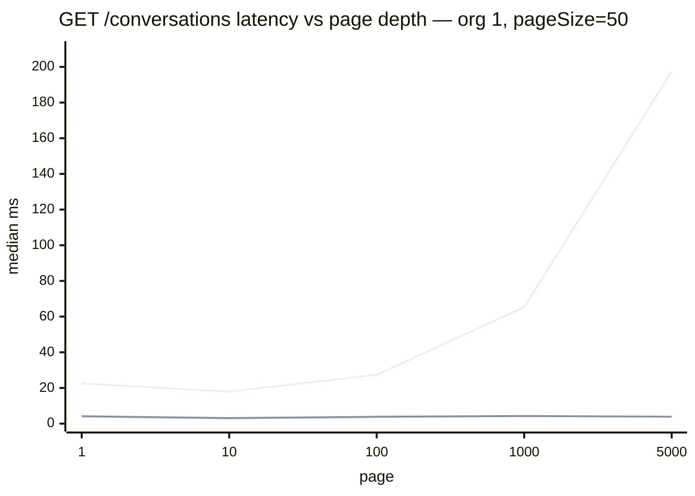

# Drill 10 — Replace OFFSET with keyset pagination, chart the difference, ship the UI

**Status:** shipped

Card 10. `GET /conversations` has paged with `LIMIT`/`OFFSET` since drill 03, where it was naive
*on purpose*. Drill 09's index made **page 1** fast and left deep pages exactly where they were:
`OFFSET 20000` still makes Postgres produce and discard 20,000 rows before returning yours.

Drill 03 predicted this and the prediction is now closed — *"page 1 stays fast forever; page
10,000 makes Postgres produce and discard 499,950 rows… the endpoint will look fine in every test
that reads page 1."* It does, and it did.

The drill is not "keyset is faster". It is what keyset **cannot** do, what breaks when the sort key
is not unique, and what each version does when a row moves under you.

---

## What shipped

- `paging=offset|keyset` and `cursor` on `GET /conversations`. **Offset is still the default** and
  is kept permanently: it is the A/B's other arm and the only way to jump to page 40.
- Keyset page: `(sort_col, id) < ($k, $i)`, `LIMIT pageSize + 1`, **no count query**. Returns
  `nextCursor`/`hasMore`, no `total`/`totalPages`.
- An **opaque** cursor (base64url JSON) carrying a version and a query-shape fingerprint.
- `KEYSET_TIEBREAK=off` and `pnpm db:test:notiebreak` — the run that goes red on purpose.
- Load-more UI: first page server-rendered, a client component appends via a Next Route Handler.
  `?mode=offset` keeps the numbered pager.
- `pnpm db:paging <depths|walk|concurrent>` and `pnpm db:explain keyset`.
- Suite 73 green (was 65).

**No migration.** Drill 09's `conversations_org_updated_idx (org_id, updated_at DESC, id DESC)` is
already the right shape for keyset on `updated_at` — the cursor's row comparison lands on it as a
single `Index Cond`. `sort=created_at` has no index for that ordering and remains the
counter-example.

Everything below: whale (org 1, 1,000,000 of 2,500,000 conversations), `pageSize=50`, after
`VACUUM (ANALYZE) conversations`. `shared_buffers` 128 MB, undersized since drill 04.

---

## Predictions, and what happened

Recorded before measuring, kept verbatim.

| # | Prediction | Outcome |
|---|---|---|
| 1 | Offset latency roughly **linear in depth**, no cliff | **Wrong, and interestingly.** It is linear *until the planner gives up on the index* and flips to a seq scan. There is a cliff. |
| 2 | Keyset **flat within noise** across all five depths | **Right.** 3.08–4.31 ms, a 1.4× spread with no trend. |
| 3 | `(a,b) < (x,y)` folds into one `Index Cond` | **Right** — and the OR form's failure is worse than expected. |
| 4 | Offset at depth still beats a seq scan, so the curve climbs *from* ~0.25 ms | **Wrong twice.** It does not stay on the index (see 1), and the curve starts at 22 ms, not 0.25 — because of `count(*)`, which I had not counted as part of the offset arm at all. |
| 5 | Tail org shows almost no offset penalty | **Right.** 1.3×–1.7× across every page it has. |

Two of five wrong. Both wrong ones are the useful part of this file.

---

## The chart

`ORG_ID=1 pnpm db:paging depths` — 3 rounds, arms interleaved within each depth, median.



The lower line is keyset. It is meant to look like the x-axis.

| page | rows skipped | offset | keyset | ratio |
|---|---|---|---|---|
| 1 | 0 | 22.53 ms | 4.11 ms | 5.5× |
| 10 | 450 | 17.93 ms | 3.08 ms | 5.8× |
| 100 | 4,950 | 27.40 ms | 3.84 ms | 7.1× |
| 1,000 | 49,950 | 65.28 ms | 4.30 ms | 15.2× |
| 5,000 | 249,950 | **197.36 ms** | **3.89 ms** | **50.7×** |

Keyset's spread across a 5,000× change in depth is 3.08–4.31 ms — inside the noise floor. Offset's
is 11×, and it is not done climbing; page 5,000 is a quarter of the way through this org.

### The tail org reaches a different conclusion, again

`ORG_ID=150 DEPTHS=1,10,50 pnpm db:paging depths`. Org 150 has 2,631 rows — 53 pages, so page 53
is as deep as deep gets.

| page | offset | keyset | ratio |
|---|---|---|---|
| 1 | 5.64 ms | 4.51 ms | 1.3× |
| 10 | 5.20 ms | 3.92 ms | 1.3× |
| 50 | 7.50 ms | 4.38 ms | 1.7× |

Prediction 5, confirmed. **Deep paging is a whale problem**, like every other problem in this repo.
A team whose largest customer is org 150 would look at the offset endpoint, see 7.5 ms at the last
page, and be completely right to leave it alone.

---

## What OFFSET is doing that keyset isn't

`pnpm db:explain keyset`. The column to read is **rows below the Limit** — the work the scan did
before the `Limit` node threw it away.

```
  depth      arm            node                       rows below Limit      ms   shared hit/read
      1      offset         Index Scan                         50          1.46   15/2
      1      keyset row     Index Scan                         50          0.29   18/0
      1      keyset OR      Index Scan                         50          0.31   18/0
    100      offset         Index Scan                       5000         19.96   93/146
    100      keyset row     Index Scan                         50          0.27   6/0
    100      keyset OR      Index Scan                         50          0.59   185/0
   5000      offset         Seq Scan                       250000        356.16   150/25242
   5000      keyset row     Index Scan                         50          0.62   4/50
   5000      keyset OR      Index Scan                         50         69.72   121166/7041
```

**`OFFSET` is a `Limit`-node parameter, not a filter.** The scan below it still produces every row
up to the offset; `Limit` discards them one at a time. At page 100 that is 5,000 rows produced to
return 50. At page 5,000 it is 250,000. The keyset arm produces **50 rows at every depth**, because
the cursor is a `WHERE` clause and the index seeks straight to it.

The plan proves the row comparison reaches the index whole:

```
->  Index Scan using conversations_org_updated_idx on conversations c
      Index Cond: ((org_id = '1'::bigint)
                   AND (ROW(updated_at, id) < ROW('2026-08-11 00:00:00+00'::timestamptz,
                                                  '019fee1d-…'::uuid)))
      Buffers: shared hit=6
```

Six buffers. Prediction 3, confirmed.

### The prediction-1 cliff

At page 5,000 the offset plan stops being an index scan and becomes a **`Seq Scan`, 356 ms,
25,242 physical reads** — the whole 198 MB heap. The planner is right: it has to produce 250,050
rows either way, and once that many rows are coming out of the scan, reading the heap sequentially
beats 250,000 random fetches. This is drill 09's 9%-of-table threshold showing up again from the
other side — there it was reached by *filtering* less selectively, here by *offsetting* further.

So "OFFSET degrades linearly" is wrong in a way that matters operationally: the curve is linear,
then steps. The step is where the export tool's timeout lives.

### The OR form is OFFSET wearing a disguise — the best finding here

`a < $k OR (a = $k AND b < $i)` is logically identical to `(a, b) < ($k, $i)`. The planner does not
treat it that way:

```
->  Index Scan using conversations_org_updated_idx on conversations c
      Index Cond: (org_id = '1'::bigint)
      Filter: ((updated_at < '2026-08-11 00:00:00+00') OR
               ((updated_at = '2026-08-11 00:00:00+00') AND (id < '019fee1d-…')))
      Rows Removed by Filter: 4951
```

The cursor became a **`Filter`**, not an `Index Cond`. The scan restarts at the top of the org's
index every time and walks forward discarding rows until it reaches the cursor — which is exactly
what `OFFSET` does. `Rows Removed by Filter: 4951` at page 100 is the same 4,950 rows the offset
plan discarded, one row off.

At page 5,000 it costs **69.72 ms and 121,166 buffer hits** against the row comparison's 0.62 ms
and 4. **The OR form is 112× slower and reintroduces the entire problem**, while looking like
correct keyset pagination in code review and passing every correctness test.

Use the row constructor.

---

## The tiebreaker

`ORDER BY updated_at DESC, id DESC`, so the cursor is the pair `(updated_at, id)` and the
predicate is `(c.updated_at, c.id) < ($k::timestamptz, $i::uuid)`.

`updated_at` is not unique — and not nearly unique. On the whale, **128,920 rows share
`2026-08-11 00:00:00+00`**, which is 12.9% of the org and the single most-common value in
`pg_stats`. A "tie" here is not two rows, it is a seventh of the tenant.

```sql
SELECT updated_at, count(*) FROM conversations WHERE org_id = 1
 GROUP BY updated_at ORDER BY count(*) DESC LIMIT 3;
--  2026-08-11 00:00:00+00 | 128920
--  2026-07-25 08:25:46+00 |      4
--  2026-04-17 18:55:16+00 |      4
```

**What breaks without it.** `KEYSET_TIEBREAK=off` drops `id`, leaving `c.updated_at < $k`.
`pnpm db:test:notiebreak`:

```
● GET /conversations (e2e) › keyset pagination › pages through every row exactly once, ties included
    Expected length: 12
    Received length: 9
Tests: 1 failed, 72 passed, 73 total
```

**Three of twelve rows silently disappear.** Not an error, not a duplicate — a walk that terminates
normally, reports `hasMore: false`, and is missing a quarter of the list. The fixture has a
four-row tie block and `pageSize=2` puts a page boundary inside it; the cursor names the tie's
timestamp, `< $k` excludes every row still sitting on it, and the rest of the block is gone.

**And on the whale it is not a page boundary you have to be unlucky to hit — it is page 1.** The
newest 128,920 conversations all share one timestamp, so every walk starts inside the tie block.
Run against real data with the arm off:

```
$ KEYSET_TIEBREAK=off docker compose up -d nest_server
$ curl -H 'X-Org-Id: 1' 'localhost:3002/conversations?paging=keyset&pageSize=50'
  page 1 last  updated_at: 2026-08-11T00:00:00.000Z
$ curl … "&cursor=$C"
  page 2 first updated_at: 2026-08-10T23:59:53.000Z     <-- the block is gone
```

Fifty rows read, **128,870 skipped in one page turn**, 200 OK, no warning anywhere. With the
tiebreaker on, page 2 starts at `2026-08-11T00:00:00.000Z` — still inside the block, where it
belongs.

That is the whole argument for the tiebreaker in one comparison, and it is only visible because the
seed deliberately clusters timestamps the way a real backfill does.

Two notes on making that test bite:

- **The `off` arm must not crash.** The first version bound `$i` without referencing it, and
  Postgres rejects a bind with more parameters than the statement uses — a 500. A crash is the easy
  bug. The arm was rewritten to bind only `$k`, so the failure is a wrong answer, which is the whole
  point.
- `db:test:naive` still fails on exactly its own two query-budget assertions. Two expected-red
  suites now, and they are red for different reasons.
- **The switch had to be declared in `docker-compose.yml` to exist at all.** A variable absent from
  a service's `environment:` list is not forwarded, so `KEYSET_TIEBREAK=off docker compose up -d
  nest_server` ran the *default* arm and printed nothing to say so. Caught the same way as the
  `ORG_ID` bug below, and within an hour of it.

### The bug the tiebreaker test found by accident

The cursor originally carried `row.updated_at.toISOString()`. **`pg` returns `timestamptz` as a JS
`Date`, which holds milliseconds; Postgres stores microseconds.** So the cursor named an instant a
few hundred microseconds *earlier* than the row it came from, and the next page's comparison
dropped every row tied on the untruncated value — the same failure as having no tiebreaker at all,
from a completely different cause.

It is invisible against the seed: `db/seed.mjs` writes whole-second timestamps, so the truncation
is a no-op across all 2.5M rows. Only the e2e fixtures, which use `now()`, have microseconds to
lose. **A bug that 2.5 million rows of realistic data cannot reproduce and twelve rows of test data
can.**

The fix is to never let the key through JavaScript. The keyset arm selects an extra column:

```sql
to_char(c.updated_at AT TIME ZONE 'UTC', 'YYYY-MM-DD"T"HH24:MI:SS.US"Z"') AS cursor_key
```

`to_char` and not `::text` because the plain cast renders through the session's `DateStyle`, and a
cursor whose format depends on a session setting breaks when someone changes one.

---

## The export tool

`ORG_ID=1 MAX_PAGES=400 pnpm db:paging walk` — the card's scenario, which is not "one deep page" but
"read the whole list".

```
  arm       pages      rows        total       per page
  offset      401    20,000      14.83 s      36.99 ms
  keyset      401    20,000       1.52 s       3.80 ms

  org holds 1,000,000 rows = 20,000 pages
  offset    full walk >= 12.3 min   keyset    full walk >= 1.3 min
```

**9.8× on the first 400 pages, and the extrapolation is a floor, not an estimate** — offset's
per-page cost is still growing at page 400, so the real full walk is worse than 12.3 minutes. The
card's "eleven minutes" was not an exaggeration.

The tail org walks completely, and shows why nobody noticed:
`ORG_ID=150 pnpm db:paging walk` — 53 pages, offset **0.30 s**, keyset **0.21 s**.

---

## Where the offset arm's floor actually comes from

Prediction 4 assumed offset page 1 would start at drill 09's 0.255 ms. It starts at 22.53 ms, and
the page query is not why.

```
$ EXPLAIN (ANALYZE) SELECT count(*) FROM conversations c WHERE c.org_id = 1
Parallel Index Only Scan using conversations_org_id_idx  (rows=333333 loops=3)
Execution Time: 29.090 ms
```

**The offset arm's floor is `count(*)`, which has nothing to do with offsets.** It reads every one
of the org's million index entries on every request to produce a number the UI uses to render
"of 20,000". Keyset's 3–4 ms is the fixed cost of the request itself — HTTP, JSON, RLS's
`BEGIN`/`set_config`/`COMMIT`, the tags query.

So dropping the count is worth more at page 1 than dropping the offset is, and the two savings only
converge at depth. Drill 05 measured this count at 33 ms and called it "the faster half"; it is the
faster half right up until you stop needing it.

---

## The concurrent-insert trace

`pnpm db:paging concurrent` — a scratch org, 9 conversations, `pageSize=3`, verbatim output.

```
  page 1 (both arms agree)  a9c346 9495c4 ba7fdb

  --- a row is inserted at the TOP: 7483aa

  offset page 2   ba7fdb <-- SEEN AGAIN  072fa6  2a774b
  keyset page 2   072fa6  2a774b  5e442c

  offset repeated 1 row(s); keyset repeated 0.

  --- a row still UNREAD (79fdd7) is updated, jumping above the cursor

  keyset pages 2..n now return 5 rows; 79fdd7 is MISSING — skipped.
```

**Offset, insert at the top:** every row shifts down one *position*. `OFFSET 3` now lands on
`ba7fdb`, which was the last row of page 1. The client sees it twice. Insert *n* rows above the
cursor and the client re-reads *n* rows; delete *n* and it skips *n*.

**Keyset, same insert:** none. The cursor names `(updated_at, id)` of a row, not a count of rows
before it, and that row did not move. The new row sorts above the cursor and is simply never
visited — which is correct: it was not in the list when the walk started.

**Keyset is not immune to everything, and this is the honest half.** A row *below* the cursor whose
`updated_at` is bumped jumps *above* the cursor and is skipped — it is never returned by any page.
The mirror case, a row above the cursor being pushed below it, is returned twice. This is real here
and not theoretical: `updateStatus()` sets `updated_at = now()`, so **every status change during a
walk can move a row across the cursor**.

| | insert above | delete above | sort key changes mid-walk |
|---|---|---|---|
| offset | duplicates | skips | duplicates or skips |
| keyset | neither | neither | **duplicates or skips** |

The only pagination that is immune to all three is one that reads from a fixed snapshot — a
`REPEATABLE READ` transaction held open across pages (which pins a connection and blocks vacuum),
or paging on an **immutable** key. `created_at, id` never changes; `updated_at, id` does. Sorting a
feed by the column that a mutation touches is what buys the anomaly.

---

## Writeup — the card's questions

### What work is OFFSET doing that keyset isn't?

Producing and discarding rows. `OFFSET n` is an argument to the `Limit` node, so the scan beneath
it still emits every row up to `n`. Measured: 5,000 rows produced for page 100, 250,000 for page
5,000, against 50 at every depth for the cursor. Past ~250,000 the planner stops using the index at
all and reads the whole 198 MB heap sequentially, because at that volume it is genuinely cheaper.

And a second job that is not about offsets: the `count(*)` the page-number UI needs, 29 ms per
request on the whale, which the cursor arm does not run because it has nothing to report.

### What's the tiebreaker and what exactly broke without it?

`id DESC`, appended to the sort key, making the cursor the pair `(updated_at, id)`. Without it the
predicate is `updated_at < $k`, which excludes every row still tied on the cursor's own timestamp.
The e2e walk returned 9 of 12 rows — three rows gone, no error, `hasMore: false`.

On the whale that is not a hypothetical boundary — it is page 1: 128,920 rows share the newest
timestamp, so a walk with the arm off reads 50 and skips 128,870 in one page turn (shown above).

`id` is a good tiebreaker here specifically because it is **uuidv7** (drill 02) — time-ordered, so
`id DESC` breaks ties in a stable, meaningful direction and the composite index's second column is
already sorted the same way. Under uuidv4 it would still be *correct* (any total order works) but
the ordering inside a tie block would be arbitrary noise.

### What can keyset not do, and how would you handle a UI that needs it?

Four things, all consequences of "the cursor is a position, not an index":

1. **Jump to page 40.** There is no cursor for page 40 without walking 39 pages first.
2. **"Page 12 of 480".** No count, so no total and no page count.
3. **Page backwards from an arbitrary point** without a mirrored `>` predicate and a reversed sort.
4. **Change sort or filters mid-walk.** The cursor's fingerprint rejects it — deliberately, but the
   client still has to start over.

How to handle a UI that needs them, roughly in the order I would reach for them:

- **Ask whether it does.** Deep pagination is almost always a search or filter problem wearing a
  pagination costume. Nobody wants page 40; they want the thing on page 40. A date filter and a
  search box remove the requirement entirely, and drill 09 already shipped the filters.
- **Approximate the total.** `reltuples` from `pg_class`, or a filtered estimate from
  `EXPLAIN`'s row estimate, renders "about 1,000,000" for free. Exactness in that number is
  something nobody has ever needed and everybody pays for.
- **Keep offset behind a hard depth cap** — which is what this repo now does, minus the cap. Pages
  1–20 by offset are cheap and give real page numbers; past that, refuse and say why. The cap is
  the part still missing here.
- **Precompute boundary cursors** if page numbers are genuinely required at depth: one row per
  (org, page) holding the cursor for that boundary, refreshed on a schedule. Correct-ish, stale
  between refreshes, and a lot of machinery.

### Stretch — what did making the cursor opaque buy?

The cursor is `base64url(JSON)` of `{v, k, i, f}`.

- **`v` — the key columns stop being an API contract.** They can change in a later release and old
  cursors are rejected by version rather than by guessing at their shape. With `?after=<timestamp>`
  the wire format *is* the schema, and adding the tiebreaker later would have been a breaking change.
- **`f` — the query-shape fingerprint, which is the one that earns its place.** A cursor minted
  under `sort=updated_at` and replayed under `sort=created_at` names a position in an ordering that
  no longer exists. Without the fingerprint that returns *wrong rows* and nothing downstream can
  detect it. With it, it is a 400 with a message. This is the biggest class of silent bug in
  cursor pagination and it costs four characters of query state.
- **It stops clients building cursors by hand**, which is what makes changing any of the above
  possible at all.

What it did **not** buy, stated plainly: **security**. base64url is an encoding. Anyone can decode
this cursor in one line — the e2e suite does. A caller can edit `k` and `i` and page from anywhere
in *their own org* (RLS and the explicit `org_id` filter still hold, so not anyone else's). If
tamper-resistance mattered, the answer is an HMAC over the payload with a server-side key, and
rejecting a bad signature. That is not built, and calling base64 "opaque" without saying this is how
people end up believing it is a security boundary.

---

## Method notes, and what would invalidate this

- **The depth comparison flatters keyset and it should be said.** Offset reaches page 5,000 in one
  request; keyset reaches it in 5,000, and those 4,999 requests warm exactly the pages the timed one
  reads. It is still the honest comparison — "jump to page 5,000" is not something a cursor client
  can do — and `walk` is the number that prices the whole shape instead of one request.
- **Arms interleaved within each depth**, 3 rounds, median. Drill 05's rule: this laptop drifts ~4%
  slower over 90 minutes, so two arms run back to back are not comparable.
- **`pnpm db:explain keyset` and `pnpm db:paging depths` disagree by ~3 ms** and both are right.
  EXPLAIN times one statement on one connection; `db:paging` times HTTP, JSON, RLS's
  `BEGIN`/`COMMIT`, the tags query and Nest's pipeline. The gap is this endpoint's fixed cost.
- **`random_page_cost` is 4.0** (drill 09), so the depth at which offset flips to a seq scan is a
  fact about this configuration. On an SSD-honest 1.1 the flip moves deeper.

### Things that went wrong, kept because they teach

1. **`ORG_ID=150 pnpm db:explain plans` never reached the container.** `docker compose exec` does
   not forward the caller's environment, so *every* invocation silently measured org 1 — for the
   whole of drill 09. Found by getting a tail-org run that printed `org 1`. Fixed with explicit
   `-e ORG_ID …` on the root scripts, and the scripts now read those with `||` rather than `??`
   because an unset host variable arrives inside the container as the empty string, not as absent.
   Drill 09's tail-org *conclusions* survive re-running (same plan choices, timings within noise) —
   it must have been run inside the container by hand — but the documented command was a lie.
   This is drill 08's lesson for the third time: **a switch that silently does nothing.**
2. **The millisecond truncation**, above. The seed's round timestamps hid it completely.
3. **`@ValidateIf` does the opposite of what it reads like.** It *skips* a property's validators
   when the condition is false, so `@ValidateIf(q => q.paging === 'keyset')` on `cursor` would have
   made `paging=offset&cursor=…` silently *accepted and ignored*. The rejection is a plain check in
   `list()` instead.
4. **The `KEYSET_TIEBREAK=off` arm crashed instead of being wrong**, because it left a bind
   parameter unreferenced. Fixed so the broken arm produces a wrong answer, which is the failure the
   drill is about.

---

## Deliberately not done

- **A depth cap on the offset arm.** It is the obvious next thing and it is a product decision
  (what does page 500 return — a 400? an empty page?), so it is named rather than guessed at.
- **Signed cursors.** Named as a gap above, with what an HMAC would buy.
- **`prevCursor` / backwards paging.** The load-more UI never pages backwards.
- **Virtualising the appended list.** 10,000 rows in one `<tbody>` will hurt the browser long
  before it hurts Postgres — the client is now the next bottleneck, and it is not this card's.
- **Caching the page or the count.** A later card. Naming it here is what stops the next pass
  "fixing" the missing `total` with a cache.
